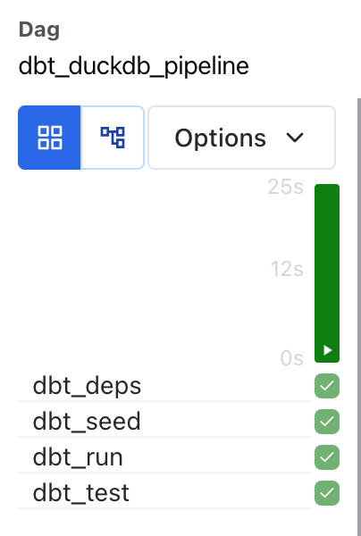

# dbt + Airflow + DuckDB: Mini Star Schema Analytics Project

This project simulates a real-world ELT pipeline using Apache Airflow and dbt to transform raw e-commerce order data into clean, queryable tables. It uses DuckDB as a local analytical engine and follows modern data engineering principles, including modular SQL modeling, data testing, and DAG orchestration. 

## Tech Stack

| Layer            | Tool              |
|------------------|-------------------|
| Orchestration     | Apache Airflow     |
| Transformation    | dbt (DuckDB adapter) |
| Analytical Engine | DuckDB              |
| Data Source       | CSV (Seeded Data)   |
| Language          | Python + SQL        |

## Data Model

The pipeline builds a star schema with:

### Fact Table
- `fct_orders`: Order-level data, joined with products and calculated total sales

### Dimension Tables
- `dim_customers`: Full name, email, signup region/year
- `dim_products`: Product metadata with category and price

### Staging Models
- Raw seed cleanup and typing

## Pipeline Flow

           ┌──────────────┐
           │   Airflow    │
           └────┬─────────┘
                │
 ┌──────────────▼──────────────┐
 │       dbt run + dbt test    │
 └──────────────┬──────────────┘
                │
      ┌─────────▼─────────┐
      │     DuckDB        │
      └───────────────────┘

## Example Metrics (could be extended)
- Total sales by category
- Customers by region
- Repeat customer rate
- Lifetime value (LTV)

## dbt Features Used

- `seeds`, `ref`, `sources`
- `tests`: unique + not null
- `Jinja` + `strptime()` for DuckDB compatibility
- `schema.yml` documentation
- Materializations: `view`, `table`

## Project Structure

```
.
├── dags/
│   ├──dbt_duckdb_dag.py           
├── dbt_duckdb_project/
│   ├── models/
│   │   ├── staging/
│   │   │   ├── stg_customers.sql
│   │   │   ├── stg_products.sql
│   │   │   └── stg_orders.sql
│   │   ├── marts/
│   │   │   ├── dim_customers.sql
│   │   │   ├── dim_products.sql
│   │   │   └── fct_orders.sql
│   ├── seeds/
│   │   ├── customers.csv
│   │   ├── products.csv
│   │   └── orders.csv
```

### Airflow DAG

This project includes an [Apache Airflow](https://airflow.apache.org/) DAG that orchestrates the full dbt workflow locally. The DAG includes the following steps:

1. **Install dependencies** with `dbt deps`
2. **Seed data** from local CSVs with `dbt seed`
3. **Build models** using `dbt run`
4. **Run tests** to validate models with `dbt test`

The DAG is manually triggerable (no schedule by default) and is designed to run against a local DuckDB target. This DAG orchestrates the full dbt workflow using BashOperators.

DAG file path:
```
airflow/dags/dbt_duckdb_pipeline.py
```

### Airflow Grid View



---

## How to Run

1. Clone the repo
2. Set-up the virtual environment
3. Install dependencies (`pip install -r requirements.txt`)
4. Initialize Airflow
5. Start Airflow
6. Trigger the DAG

---

## Author

**Built with ❤️ by Melissa Nicholas**  
Senior BI Engineer | Data Nerd | Dashboard Whisperer  
[Connect on LinkedIn](https://www.linkedin.com/in/melissa-nicholas-7a143593/)
